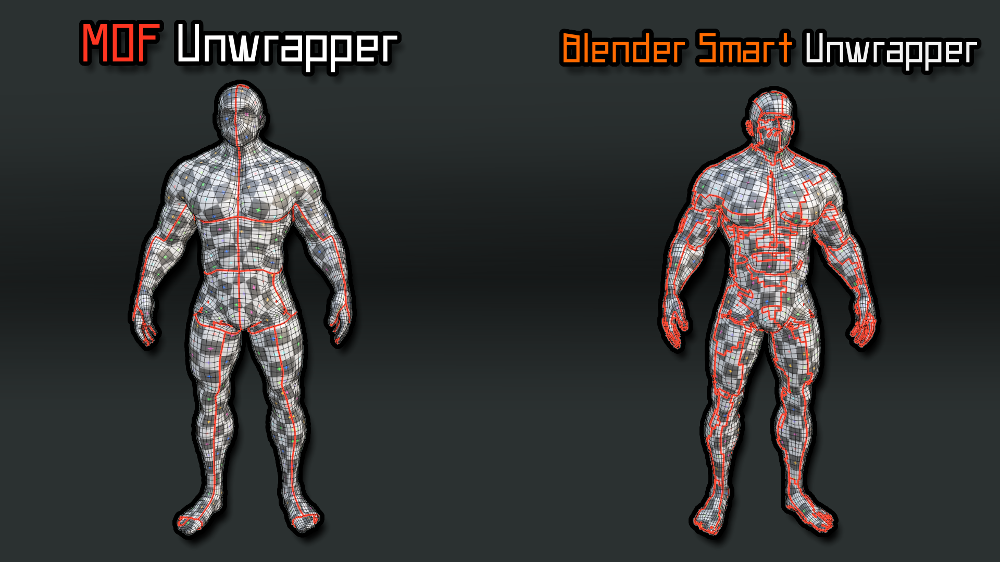
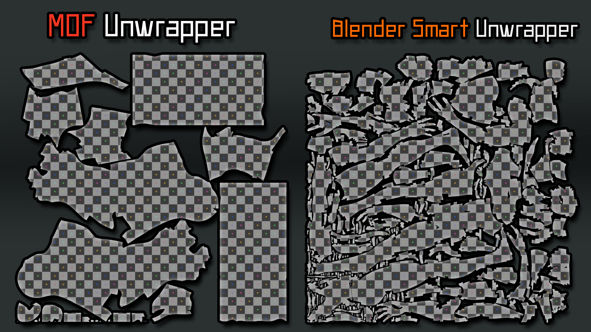
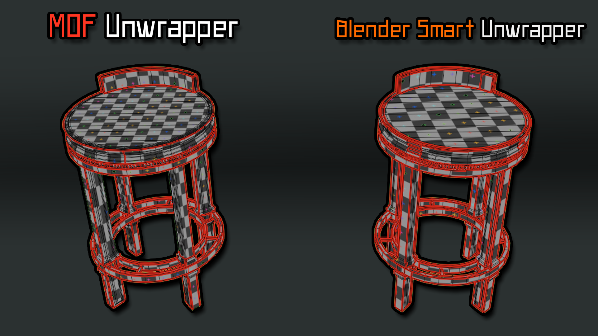
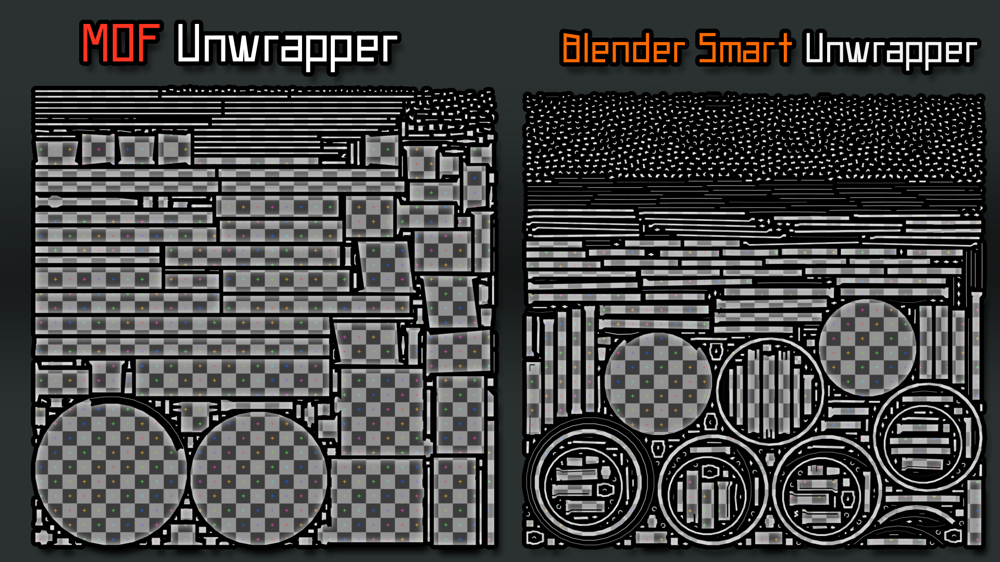
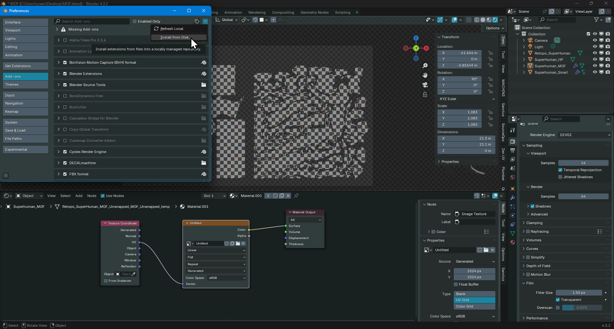
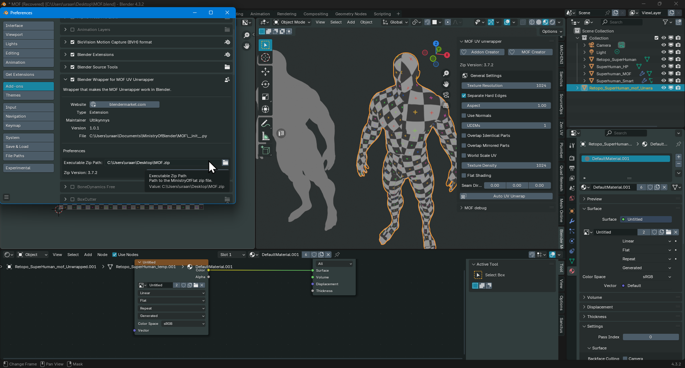
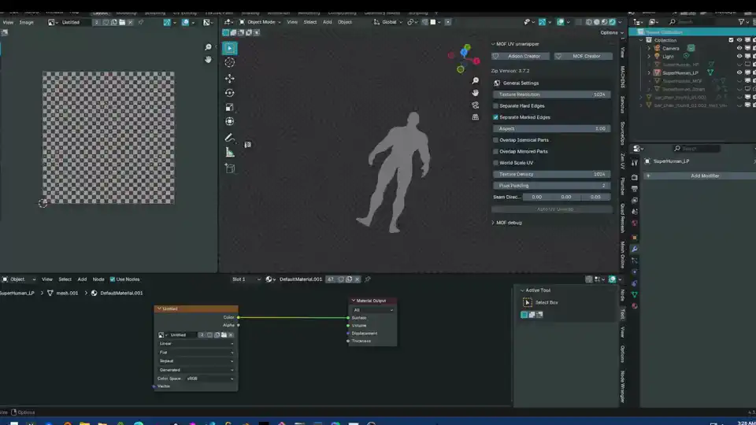
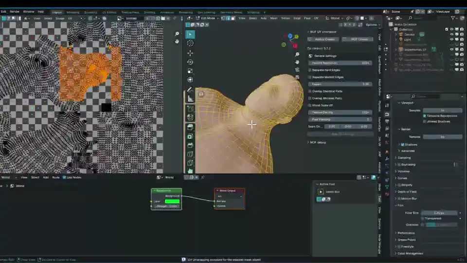

# MinistryOfBlender
A Blender Addon wrapper for the [MinistryOfFlat](https://www.quelsolaar.com/ministry_of_flat/) Unwrapper

## What is this?

MinistryOfBlender is a Blender addon that integrates the powerful MinistryOfFlat UV unwrapping tool directly into Blender's workflow. It provides a seamless bridge between Blender and MOF, allowing you to achieve superior UV unwraps with significantly fewer UV islands compared to traditional methods like Smart Unwrap.

**Key Benefits:**
- **Fewer UV Islands:** Dramatically reduces the number of UV islands, making texturing easier and more efficient
- **Better Texture Density:** Maintains higher pixel density across UV layouts, especially on complex meshes
- **Works on Any Geometry:** Excellent results on both organic shapes (characters, creatures) and hard surface models (props, architecture)
- **Integrated Workflow:** Use MOF unwrapping directly from Blender's UV Editing workspace without switching applications

# Disclaimer
This addon does **NOT** contain the MinistryOfFlat Tool itself, it is only a wrapper that makes it work with Blender.

# Showcase

#### Male Body | Organic shape
####  MOF | UV Islands: 35
#### Smart Unwrap | UV Islands: 241
Less islands, which is easier to texture

#### Chair | Hard Surface
#### MOF 180.31px/m @ UV Islands: 334
#### Smart Unwrap 110.87px/m  @ UV Islands: 1335

At higher counts the island count will negatively impact the texture density as well

# How to use

## Step 1 | Install the addon from the zip file

**Installation:**
- Download the latest release ZIP from the releases page
- In Blender, go to Edit > Preferences > Add-ons (or Get Extensions for Blender 4.4+) > Install
- Select the downloaded ZIP file

## Step 2 | Install MOF from the official site [MinistryOfFlat](https://www.quelsolaar.com/ministry_of_flat/)

## Step 3 | Unwrap and Pack

## Optional Step | Use Seams to fix problematic unwraps

### You can support me by checking out my other addons❤️
#### [Blender Marketplace](https://blendermarket.com/creators/ultikynnys)
